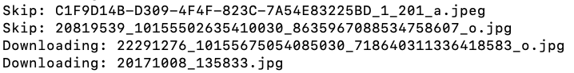

# Contentful Downloader

A Node.js script to download image assets from a Contentful export file.

## Background

Contentful changed their free tier and archived these spaces. Users can download text content with the official CLI but it does not include images.

## Features

- Limits concurrent download requests.
- Skips files that already exist locally.
- Retries failed downloads automatically.

## Requirements

- Node.js
- A Contentful export file (`contentful.json`)

## Usage

### 1. Export data from Contentful

Install and use the Contentful CLI:

```bash
npm install -g contentful-cli
contentful login
contentful space export --space-id {YOUR_SPACE_ID}
```

### 2. Install and run the downloader

```bash
npm install
npm run migrate
```

## Demo



## Author

Jorge Donoso

## License

MIT
